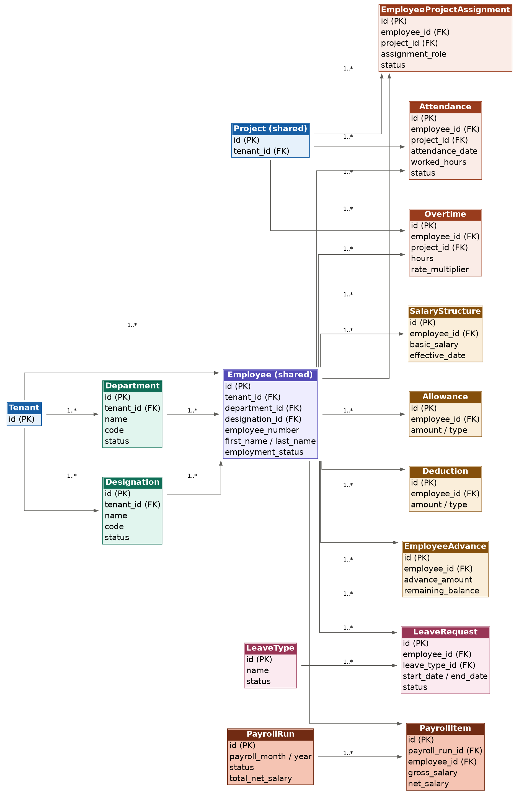

# Neirah Construction OS — HR Module ERD

## Entity Relationship Diagram



The Entity Relationship Diagram represents the database architecture for the HR, Attendance, Leave, Payroll, and Project Labour Costing module.

This design follows the Neirah Construction OS Master Project Details & Common Development Standards.

---

## 1. Architecture Principles

The HR module follows the Neirah Construction OS modular-monolith architecture.

The core business flow is structured as:
Employee → Project Assignment → Attendance → Working Hours → Leave / Overtime → Salary → Payroll → Payslip → Project Labour Cost

The module uses shared Construction OS entities rather than creating competing versions of platform-level entities.

---

## 2. Shared Core Entities

The following platform entities are shared across modules:
* **Tenant**
* **Employee**
* **Project**
* **User**
* **Role**
* **Permission**
* **Customer**
* **Supplier**

The HR module must not create duplicate permanent Project, Tenant, User, Role, Permission, Customer, Supplier, or Employee architectures.

### Tenant
Root entity for multi-tenant data isolation. Every tenant-owned record contains `tenant_id`.

Fields:
* `id` (PK, UUID)

### Employee (Shared)
Central entity representing all personnel across the platform.

Fields:
* `id` (PK, UUID)
* `tenant_id` (FK → Tenant.id)
* `department_id` (FK → Department.id)
* `designation_id` (FK → Designation.id)
* `employee_number`
* `first_name`
* `last_name`
* `email`
* `phone`
* `nic_or_id`
* `date_of_birth`
* `gender`
* `address`
* `employment_type`
* `joining_date`
* `employment_status`
* `emergency_contact`
* `created_at`, `updated_at`, `created_by`, `updated_by`

### Project (Shared)
Shared platform entity for construction projects.

Fields:
* `id` (PK, UUID)
* `tenant_id` (FK → Tenant.id)

---

## 3. HR Master Entities

### Department
Fields: `id` (PK, UUID), `tenant_id` (FK → Tenant.id), `name`, `code`, `description`, `status`, `created_at`, `updated_at`, `created_by`, `updated_by`

Relationships:
* Tenant 1 ──── 0..* Department
* Department 1 ──── 0..* Employee

### Designation
Fields: `id` (PK, UUID), `tenant_id` (FK → Tenant.id), `name`, `code`, `description`, `status`, `created_at`, `updated_at`, `created_by`, `updated_by`

Relationships:
* Tenant 1 ──── 0..* Designation
* Designation 1 ──── 0..* Employee

---

## 4. Employee Project Assignment

### EmployeeProjectAssignment
Fields: `id` (PK, UUID), `tenant_id` (FK → Tenant.id), `employee_id` (FK → Employee.id), `project_id` (FK → Project.id), `assignment_role`, `start_date`, `end_date`, `status`, `created_at`, `updated_at`, `created_by`, `updated_by`

Relationships:
* Employee 1 ──── 0..* EmployeeProjectAssignment
* Project 1 ──── 0..* EmployeeProjectAssignment

---

## 5. Attendance & Leave Management

### Attendance
Fields: `id` (PK, UUID), `tenant_id` (FK → Tenant.id), `employee_id` (FK → Employee.id), `project_id` (FK → Project.id, nullable), `attendance_date`, `check_in`, `check_out`, `worked_hours`, `status`, `notes`, `created_at`, `updated_at`, `created_by`, `updated_by`

Status Values: `Present`, `Absent`, `Leave`, `Half Day`, `Holiday`

Relationships:
* Employee 1 ──── 0..* Attendance
* Project 1 ──── 0..* Attendance

### LeaveType
Fields: `id` (PK, UUID), `tenant_id` (FK → Tenant.id), `name`, `description`, `status`, `created_at`, `updated_at`, `created_by`, `updated_by`

Relationship:
* LeaveType 1 ──── 0..* LeaveRequest

### LeaveRequest
Fields: `id` (PK, UUID), `tenant_id` (FK → Tenant.id), `employee_id` (FK → Employee.id), `leave_type_id` (FK → LeaveType.id), `start_date`, `end_date`, `number_of_days`, `reason`, `status`, `review_comment`, `created_at`, `updated_at`, `created_by`, `updated_by`

Status Values: `Pending`, `Approved`, `Rejected`, `Cancelled`

Relationships:
* Employee 1 ──── 0..* LeaveRequest
* LeaveType 1 ──── 0..* LeaveRequest

---

## 6. Overtime & Compensation

### Overtime
Fields: `id` (PK, UUID), `tenant_id` (FK → Tenant.id), `employee_id` (FK → Employee.id), `project_id` (FK → Project.id), `date`, `hours`, `rate_multiplier`, `reason`, `status`, `created_at`, `updated_at`, `created_by`, `updated_by`

Relationships:
* Employee 1 ──── 0..* Overtime
* Project 1 ──── 0..* Overtime

### SalaryStructure
Fields: `id` (PK, UUID), `tenant_id` (FK → Tenant.id), `employee_id` (FK → Employee.id), `basic_salary`, `effective_date`, `salary_status`, `created_at`, `updated_at`, `created_by`, `updated_by`

Relationship:
* Employee 1 ──── 0..* SalaryStructure

### Allowance
Fields: `id` (PK, UUID), `tenant_id` (FK → Tenant.id), `employee_id` (FK → Employee.id), `name`, `amount`, `allowance_type` (One-time/Recurring), `effective_date`, `payroll_month`, `notes`, `created_at`, `updated_at`, `created_by`, `updated_by`

Relationship:
* Employee 1 ──── 0..* Allowance

### Deduction
Fields: `id` (PK, UUID), `tenant_id` (FK → Tenant.id), `employee_id` (FK → Employee.id), `name`, `amount`, `deduction_type` (One-time/Recurring), `effective_date`, `notes`, `created_at`, `updated_at`, `created_by`, `updated_by`

Relationship:
* Employee 1 ──── 0..* Deduction

### EmployeeAdvance
Fields: `id` (PK, UUID), `tenant_id` (FK → Tenant.id), `employee_id` (FK → Employee.id), `advance_amount`, `date`, `recovery_amount`, `remaining_balance`, `status`, `notes`, `created_at`, `updated_at`, `created_by`, `updated_by`

Relationship:
* Employee 1 ──── 0..* EmployeeAdvance

---

## 7. Payroll Processing

### PayrollRun
Fields: `id` (PK, UUID), `tenant_id` (FK → Tenant.id), `payroll_month`, `year`, `status`, `total_gross_salary`, `total_deductions`, `total_net_salary`, `generated_date`, `created_at`, `updated_at`, `created_by`, `updated_by`

Relationship:
* PayrollRun 1 ──── 1..* PayrollItem

### PayrollItem
Fields: `id` (PK, UUID), `tenant_id` (FK → Tenant.id), `payroll_run_id` (FK → PayrollRun.id), `employee_id` (FK → Employee.id), `basic_salary`, `total_allowances`, `overtime_amount`, `gross_salary`, `total_deductions`, `advance_recovery`, `net_salary`, `created_at`, `updated_at`

Relationships:
* PayrollRun 1 ──── 1..* PayrollItem
* Employee 1 ──── 0..* PayrollItem

---

## 8. Payroll Calculation Logic

The authoritative calculation is computed in the backend/service layer using standard precision decimal types (`NUMERIC`):

```text
gross_salary = basic_salary + total_allowances + overtime_amount
net_salary   = gross_salary - total_deductions - advance_recovery